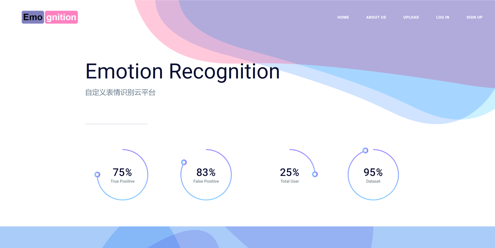
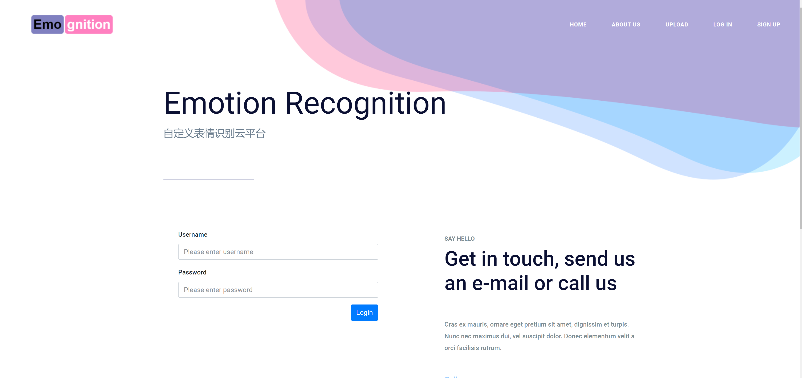
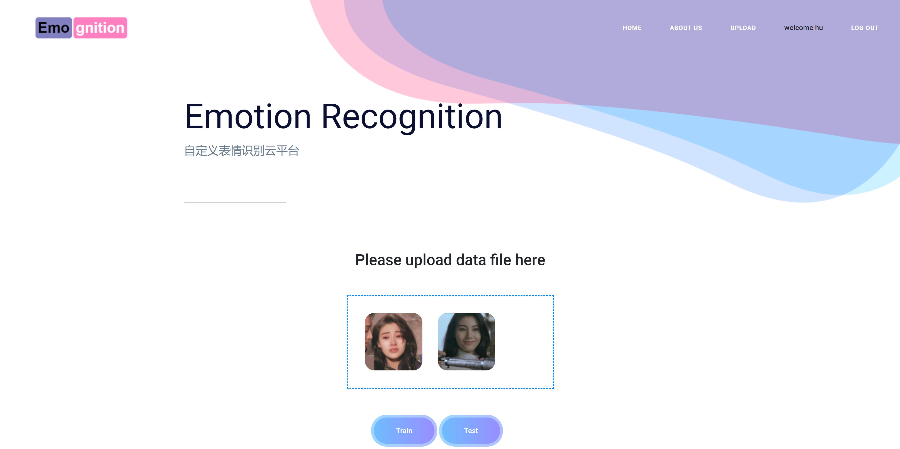
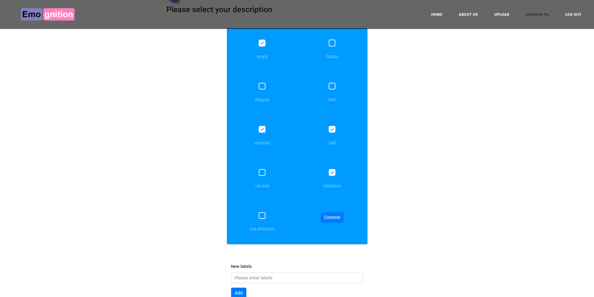
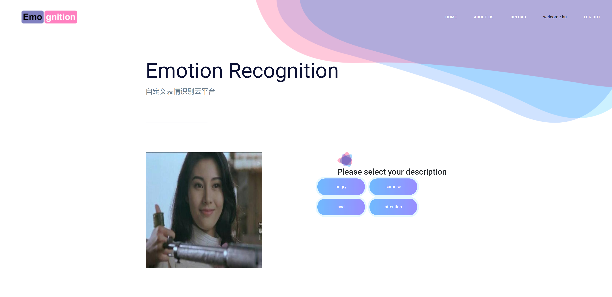
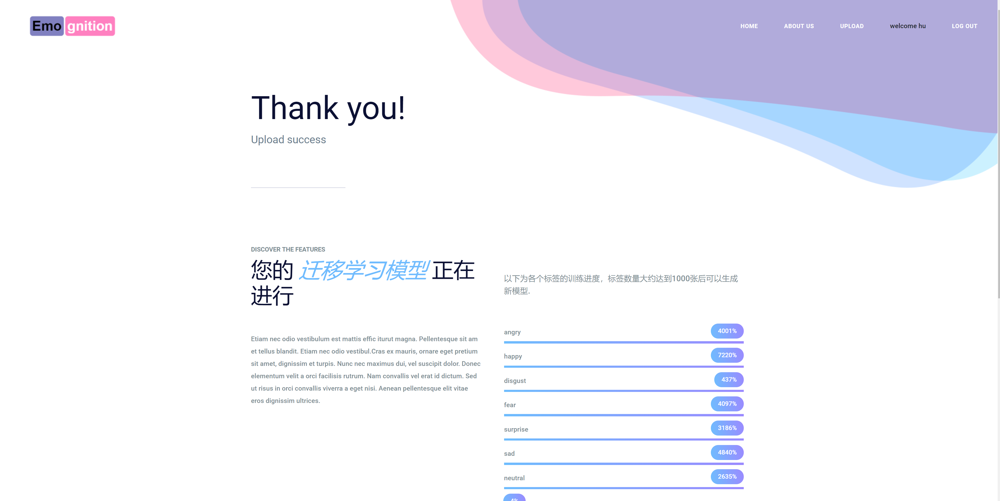
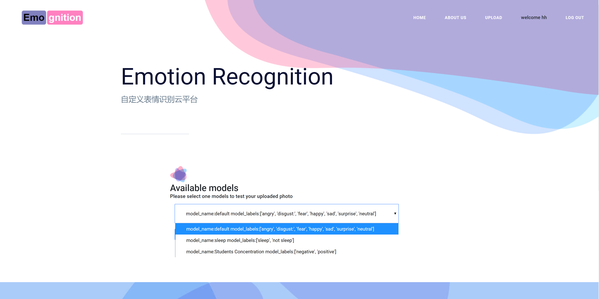
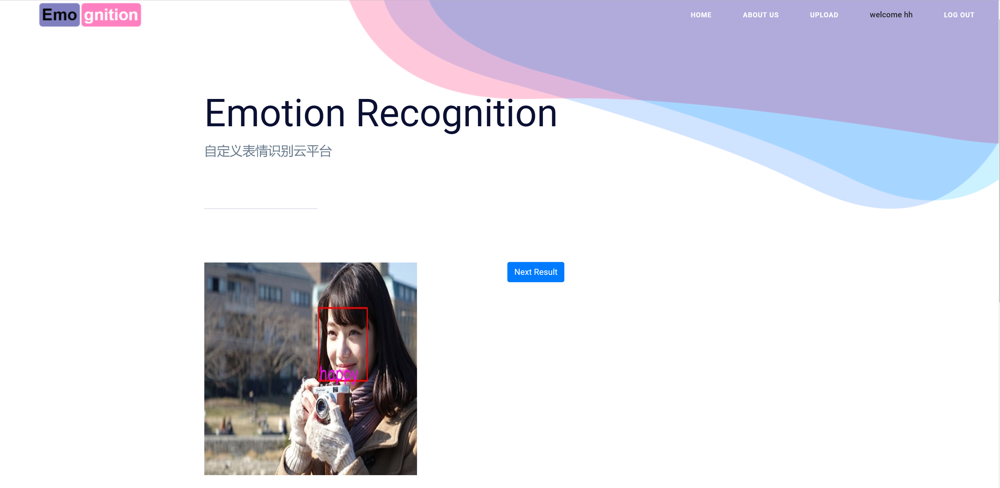

# 多场景表情识别平台——Emognition

> 利用迁移学习实现只需要极少的数据样本，即可让用户根据自己的需求训练出各异的表情识别模型

目前本项目已部署到服务器，可以通过访问 http://prp1.work:8090/ 进行使用



## 系统环境
- 操作系统：Ubuntu 16.04
- python版本: python3.5 
- Mongodb版本: Mongo 3.2.22
- python第三方库引用见 [requirement.txt](./requirement.txt)

## 代码目录
├── static &nbsp; &nbsp; &nbsp; &nbsp;  &nbsp; &nbsp;&nbsp; &nbsp; &nbsp; &nbsp; &nbsp; &nbsp; &nbsp; &nbsp;&nbsp;&nbsp;&nbsp;# Web需要的资源目录  
│ &nbsp; &nbsp; &nbsp;  └── TmpModels&nbsp; &nbsp; &nbsp; &nbsp; &nbsp; &nbsp;# web服务过程中的临时文件夹  
│ &nbsp; &nbsp; &nbsp;  └── TmpResult  &nbsp; &nbsp; &nbsp; &nbsp; &nbsp; &nbsp; &nbsp;# web服务过程中的临时文件夹  
│  &nbsp; &nbsp; &nbsp; └── TmpUploadDir &nbsp; &nbsp; &nbsp; &nbsp;# web服务过程中的临时文件夹  
│ &nbsp; &nbsp; &nbsp;  └── css  
│ &nbsp; &nbsp; &nbsp;  └── fonts  
│ &nbsp; &nbsp; &nbsp;  └── img  
│ &nbsp; &nbsp; &nbsp;  └── js  
│ &nbsp; &nbsp; &nbsp;  └── scss  
│ &nbsp; &nbsp; &nbsp;  └── vendors  
├── templates &nbsp; &nbsp; &nbsp; &nbsp; &nbsp; &nbsp; &nbsp; &nbsp; &nbsp; &nbsp; &nbsp; &nbsp;&nbsp;&nbsp;&nbsp;# Web前端页面设计  
│ &nbsp; &nbsp; &nbsp;  └── sierra&nbsp; &nbsp; &nbsp; &nbsp; &nbsp; &nbsp; &nbsp; &nbsp; &nbsp; &nbsp; &nbsp; &nbsp; # boostrap模板  
│ &nbsp; &nbsp; &nbsp;  ├── login.html  
│ &nbsp; &nbsp; &nbsp;  ├── navigateTest.html  
│ &nbsp; &nbsp; &nbsp;  ├── navigateTrain.html  
│ &nbsp; &nbsp; &nbsp;  ├── progress.html  
│ &nbsp; &nbsp; &nbsp;  ├── register.html  
│ &nbsp; &nbsp; &nbsp;  ├── setTrainLabel.html  
│ &nbsp; &nbsp; &nbsp;  ├── testResult.html  
│ &nbsp; &nbsp; &nbsp;  ├── testSuccess.html  
│ &nbsp; &nbsp; &nbsp;  ├── upload.html  
│ &nbsp; &nbsp; &nbsp;  ├── uploadSuccess.html  
├── transfer_learning_source &nbsp; &nbsp; &nbsp; &nbsp;  &nbsp;# 迁移学习代码  
│ &nbsp; &nbsp; &nbsp;  ├── convert_csv_to_48_48.py  
│ &nbsp; &nbsp; &nbsp;  ├── convert_current.py  
│ &nbsp; &nbsp; &nbsp;  ├── convert_fer2013.py  
│ &nbsp; &nbsp; &nbsp;  ├── emotion_classifier.py  
│ &nbsp; &nbsp; &nbsp;  ├── emotion_classifier_trans.py  
│ &nbsp; &nbsp; &nbsp;  ├── emotion_train_self.py  
│ &nbsp; &nbsp; &nbsp;  ├── image_preprocessing.py  
│ &nbsp; &nbsp; &nbsp;  ├── transfer_VGG.py  
│ &nbsp; &nbsp; &nbsp;  ├── transfer_continue.py  
│ &nbsp; &nbsp; &nbsp;  ├── transfer_learning.py  
│ &nbsp; &nbsp; &nbsp;  ├── transfer_sleep.py  
├── GFS.py &nbsp; &nbsp; &nbsp; &nbsp; &nbsp; &nbsp; &nbsp; &nbsp; &nbsp; &nbsp; &nbsp; &nbsp;&nbsp;&nbsp;&nbsp;&nbsp;&nbsp;&nbsp;&nbsp;&nbsp;&nbsp;&nbsp;&nbsp;&nbsp;&nbsp;&nbsp;&nbsp;&nbsp;&nbsp;&nbsp;&nbsp;# 使用GridFs格式存储照片到mongo所封装的类  
├── app.py &nbsp; &nbsp; &nbsp; &nbsp; &nbsp; &nbsp; &nbsp; &nbsp; &nbsp; &nbsp; &nbsp; &nbsp;&nbsp;&nbsp;&nbsp;&nbsp;&nbsp;&nbsp;&nbsp;&nbsp;&nbsp;&nbsp;&nbsp;&nbsp;&nbsp;&nbsp;&nbsp;&nbsp;&nbsp;&nbsp;&nbsp;# Flask的运行文件，Web服务的核心  
├── check_and_train_models.py &nbsp; &nbsp; &nbsp; &nbsp; &nbsp;# 轮询检查数据集是否已满足迁移学习要求  
├── requirement.txt &nbsp; &nbsp; &nbsp;  &nbsp; &nbsp; &nbsp; &nbsp; &nbsp; &nbsp; &nbsp; &nbsp; &nbsp;&nbsp; &nbsp;&nbsp;&nbsp;# python第三方库引用列表
## 项目部署指南

1. 下载项目源码
```
git clone https://github.com/Yangzhengtang/Emognition
```

2. 安装python虚拟环境virtualenv
```
pip3 install virtualenv
```

3. 创建虚拟环境
```
virtualenv --no-site-packages venv
```

4. 进入虚拟环境
```
source venv/bin/activate
```

5. 安装python第三方库依赖
```
pip install -r requirement.txt
```

6. 后台启动Mongodb
```
nohup mongod --dbpath=/var/lib/mongodb &
```

7. 后台运行Web服务程序
```
nohup python3 app.py &
```

8. 后台运行轮询检查程序，判断预约模型是否达到可以迁移学习的阈值
```
nohup python3 check_and_train_models.py &
```

## 用户使用指南
- 访问 http://prp1.work:8090/ 并注册登录，登录后可以上传照片  


- 上传照片后可以选择train或是test，train是定制特定分类的表情识别模型，test是利用已有的模型进行表情识别的测试  


- 选择train后进入标签选择的页面，用户可以选择已有的标签或是自己上传自定义的表情标签，设计新模型  


- 选择完自定义的模型后，需要对刚才上传的照片打标签  


- 打完标签后等待后台使用迁移学习对该模型进行快速的训练，只有当数据库中该模型所有标签的照片都达到迁移学习所需要的阈值(目前为100张)时，后台的迁移学习训练才会开始，页面右下角显示当前各个标签的已有数量与阈值的比值  


- 上传完照片后也可以选择test，直接使用已有的模型进行测试，用户只能使用自己贡献过带有标签的训练照片的模型  


- 选择完模型后可以看到模型识别的结果  


## 开发人员
杨正瑭 胡煜宗 江智昊 尹广浩 施纬  
302995105@qq.com